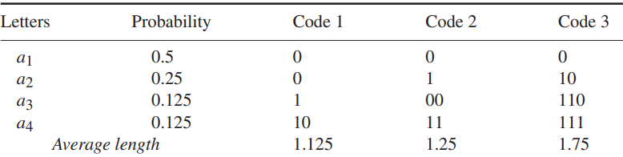
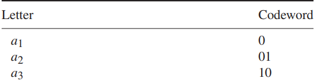
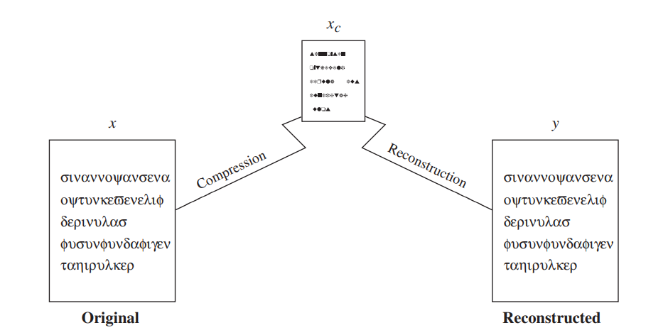

# Chapter 2 : Compression

## 2.1 What is compression
Let us continue with our example: the road trip. There are two bystanders to which you can ask the route- one is a prodigy and tells each of the multiple routes to your destination, and another knows the best/shortest route to the destination. Obviously, any normal person will get confused on hearing the entire lists of route he can take, and will probably end up getting lost again. The other guy, on the other hand, suggests the best route, and hence, is more often the preferred choice, as he too has decided the optimum route after considering all the routes.

Irrespective of who gives us the route, we generally choose the best route of the mentioned ones, and thus, the two bystanders effectively convey the same information. Thus, bystander 2 has conveyed the same information as bystander 1, while talking less (or consuming less of our memory space, lets say). In short, route by bystander 2 is the *compressed* form of whatever bystander 1 said.

Consider another example: the reader probably knows, and prefers the use of π as 3.14, and not as 3.14159265358... , and speed of light as 3 x 108 m/s, and not 299792458 m/s. Formally, **compression refers to conversion (of data, a data file, or a communications signal) in order to reduce the space occupied or bandwidth required**. Compression is normally used to reduce the size of data/file without removing information.

With the advent of technology, more and more exchange and storage of data came to be, and as storage of this data is somewhat costly, the search for better and better ways of compression began to be carried out. This search branched out into different fields, such as data compression, signal compresson etc, and hence, compression is now a very vast, disjoint branch.

Recall from chapter 1 that there are different algorithm paradigms (commonly used approach in designing algorithms). The goal of compression is one: to *compress* the data/file, ie, to reduce the space taken by it, and since it is not a way of designing an algorithm, compression is not a paradigm. Rather, it is a different field in computer science. The different algorithms used for different kinds of compression use different algorithm paradigms like the ones mentioned in chapter 1.

## 2.2 Why compression
As mentioned above, the need of compression is quite obvious
    - To save *space* while storing data
    - To save *time* while transmitting it
    - Most files have a lot of redundant content, and hence, if these can be "comdensed" into a simple representation (lets call it a black box) then it is much easier to store as well as understand.

For example, we know that a movie (1080p) takes around 2gb (not considering bluray). But an uncomressed 1080p 8-bit video requires about 10gb *per minute*. This means that an average movie will take up 1200gb, ie, more than 1TB space. Similarly, the pictures we save in our galleries (jpg or png) are compressed, and not actually the RAW files, which takes up a lot more space. In the modern era, where facetime, skype and other video conferencing is now more preferred than a phonecall, compression is extremely important.

## 2.3 Some terminologies used in compression
### 2.3.1 Self information and entropy
This was a term coined by Shannon. Suppose we have an event A whose probability of occurence is P(A). Then, _Self information_ of A is given by  
> *i(A) = - logbP(A)*

where b can be 2 (unit is bits), e (unit is nats) or 10 (unit is hartleys). In general, we take b as 2.
As we know that -log(x) is larger for an x that is closer to 0 in the interval (0,1). Thus, **if the probability of an event is low, the amount of self information associated with that event is high** , and vice versa.

Now, consider we have a set of independent events *Ai*, and sample space S is the union of all these events. The average self information associated with some random experiment is then given by:
> H = Σ P(Ai) x i(Ai) = -Σ P(Ai) x logbP(Ai)

This quantity is called the **entropy** of the experiment. In other words, entropy is a **measure of the average number of binary symbols needed to code the output** of the experiment.

> For example, consider the binary sequences 000000 and 010101.
> 1. in 000000 , P(0)=1, and thus, entropy H = -1logl = 0. Entropy is 0, as we dont need any information to represent which symbol is next in the series, as the series contains only 0s.
> 2. in 010101 , p(0)=P(1)=0.5, and thus, H= -(0.5log0.5 + 0.5log0.5) [taking base as 2,] = -(-1) = 1. Since base is 2, we get that we need an average of 1 bit to represent each character in the string (which is true)

### 2.3.2 Models
Designing the data into a good model can be helpful in constructing efficient compression techniques for the data. Some commonly used models are:
- **Physical model**: Used when we know the _physics_ of the data generation process. An example is speech compression, as knowledge about the physics of speech production can be used to construct a mathematical model for the sampled speech process, and sampled speech can be encoded using this model. (In general, however, the physics of data generation is too complicated to understand, and hence we cannot make such models).

- **Probability model**: Keep the independence assumption and assign probabilities to each letter of the alphabet. Using the probability model, we can construct some very efficient codes to represent the letters in the alphabet . However, these codes are only efficient if our mathematical assumptions are in line with reality.

- **Markov model**: For models used in lossless compression, we use a specific type of Markov process called a *discrete time Markov chain*:
    - Let {xi} be the sequence of observations, then the sequence follows k-th order Markov model if  P(xn|xn-1,....,xn-k) = P(xn|xn-1,....,xn-k,...)
    - This can be stated as: knowledge of the past k symbols is equivalent to the knowledge of the entire past history of the process
    - Most commonly used Markov model is first order Markov model, ie,  P(xn|xn-1) = P(xn|xn-1,xn-2,xn-3,...)

Markov models are particularly useful in text compression where the probability of the succeeding letter is greatly influenced by the preceding letters.

- Oftentimes, it is not easy to use a single model to describe the source. In such cases, we can define a *composite source*, which can be seen as a combination of several sources, with only one source being active at any given time

### 2.3.3 Coding
Coding is the process of assignment of binary sequences to letters of an alphabet. The set of binary sequences is called a code, and each individual members of the set are called codewords. A trivial example of coding can be taken from the ASCII code of the English alphabet: A is 1000001, and that of a is 1000011. ASCII also contains codes for certain characters like "," (comma, ascii is 0011010). Each ASCII codeword has a fixed, same number of bits, and thus, ASCII is an example of **fixed length code**. 

More often than not, we use lesser number of bits to represent those letters that occur more frequently than others (as reducing the number of bits required, and hence the memory required is the cruz of compression in the first place). The average number of bits per symbol is called the **rate** of the code. A typical example that uses this idea is the Morse code (you probably already know what it is from spy and action movies :) ) in which the codewords that occur more frequently are shorter (E is `·`, while Z is `—··`)

To be useful, a code should not only reduce the length of encoding, but also have the ability to transfer information in an unambiguous manner. Consider the following 3 encodings of the same letters:

(Average length is given by ΣP(ai)n(ai) , n(ai) is the number of bits in the codeword of ai)

Sheerly based on average length, Code 1 is no doubt the best one. However, consider a string 00. This can be decoded by the user as a1a1,a1a2,a2a1 or a2a2, and the user cannot identify which is the intented information that should be recieved. Hence, Code 1 is ambiguous  Now, consider Code 2. Here too, a string 000 may mean a1a1a1, a1a3 or a3a1, and thus 2 is also ambiguous.

Now, consider the Code 3. Notice that except for a4, all the codewords end in 0 (ie, 0 deonotes the end of a codeword), and a4 is the only one with 3 1-s. In other words, the only way to get 3 1-s in a row is to have an a4. Thus, the decoding can be done as: accumulate bits until you get a 0, or 3 1-s. Thus, there is no ambiguity in Code 3, and it is **uniquely decodable**. In the case of Code 3, the decoder knows the moment a code is complete which character is to be decodedm and this property makes Code 3 an **instantaneous code**. (Keep in mind that this is not a requirement for unique decodability)

Keep in mind that this is not always the case. For instance, consider the binary string 0101010 and the alphabet as:

two valid decodings are a1a3a3a3, and a2a2a2a1 . Now, for the same alphabet, consider the string 01010101. If the first 0 is decoded as a1, we try the encoding, as a1a3a3a3, and we are left a bit 1 in the end. This bit is called dangling bit. A valid decoding for this is a2a2a2a2. thus, the string can be uniquely decoded.

A code in which no codeword is a prefix of the other is a code in which we will never have to deal with the prospect of a dangling suffix becoming a codeword. We don't have to worry about discovering a dangling suffix that is identical to a codeword because the set of dangling suffixes is the null set in this case. A **prefix code** is one in which no codeword is a prefix to another codeword.A simple way to check if a code is a prefix code is to draw the rooted binary tree corresponding to the code. If it is a prefix code, only the leaves of the tree will have codewords.

## 2.4 Compression techniques
Compression is not a 1 step process; rather it is considered to have 2 steps: compression algorithm that takes an input X and gives an output X', and a reconstruction algorithm that operates on this X' to create an output Y. 

Based on the reconstruction requirements, compression schemes are divided into 2 main categories: lossless compression (X and Y are identical) and lossy compression(greater degree of compression than lossless, but allows Y to differ from X).

### 2.4.1 Lossless compression
As the name suggests, this meathod involves no loss of data. The original data can be recovered as was from the compressed data if data has been losslessly compressed. Lossless compression is typically utilised in situations where any difference between the original and reconstructed data is unacceptable. An example is text compression, where even a minute change can lead to misinterpretations. Data from archaeological sites, for instance, if compressed lossily, even though changes may not be detected on reconstruction, may lead to fake information on further enhancing (which they do). Satellite images, have to be enhanced to detect various information about outer space, and this too, if not reconstructed as it was trnsmitted leads to fake information, and oftentimes it might be impossible to get the sample data again within reasonable periods of time. The LZ algorithms and huffmann coding are examples of lossless compression algorithms.

### 2.4.2 Lossy compression
As indicated by the name, this techniques involve some loss of information, and data that have been compressed using lossy techniques generally cannot be recovered or reconstructed exactly is it was. At the cost of this distortion (which may be permitted to an untraceable degree) we can obtain much greater degrees of compression than lossless algorithms. In many applications, the _exact_ reconstruction of data is not required. For example while sending speech, exact value of each sample of speech is not required. Depending on the quality required of the reconstructed speech, varying amounts of loss of information about the value of each sample can be tolerated. In the same lines, if the speech is required to be stored in a limited storage facility, such as a CD, then amount of information lost is much more.

As discussed early on, playing a movie, or any video in general, even though the reconstruction is different from the original, as long as differences dont result in huge distortions, we dont mind. image, speech, video processing are examples of lossy compression.

## 2.5 How to compare different compression algorithms
As there are many ways to compare algorithms in geneeral, there are a large number of ways to compare compression algorithms as well, since this is a much needed area in modern information technology. We could measure the relative complexity of the algorithm, the memory required to implement the algorithm, how fast the algorithm performs on a given machine, the amount of compression, and how closely the reconstruction resembles the original etc.

- An intuitive way of measuring compression algorithms will be to look at the extend to which the algorithm compresses the given set of data, which can be easily be given by the ratio of number of bytes required to represent the data before and after compression. This ratio is called the **compression ratio** of the algorithm. For example, if a 256x256 pixel image requires  65,536 bytes. Say a compression algorithm has compressed this such that it now occupies only 16,384 bytes. Then, the compression ratio of the mentioned algorithm would be 4:1

- The average number of bits required to represent a single sample is another approach to report compression performance. This is referred to as **rate**. If we assume 8 bits per pixel in the case of the compressed image given above, the average number of bits per pixel in the compressed representation is 2. As a result, we say the rate is 2 bits per pixel.

- In lossy compression, as the reconstruction differs from the original data, we need some way to quantify this _difference_. This quantity is known as **distorion**. Other terms that are also used when talking about differences between the reconstruction and the original are *fidelity and quality*. When we say that the fidelity or quality of a reconstruction is high, we mean that the difference between the reconstruction and the original is small. This *small* is not always mathematical, and often depends on the human perception.
