# Chapter 3: A few Compression Algorithms
In this chapter, we will discuss about a few compression algorithms such as the Huffman coding, LZ algorithm, image compression etc, and potential drawbacks and improvements in these algorithms.

## 3.1 Huffman Coding
Huffman coding is a **lossless data compression algorithm**. It is one of the more popular data compression algorithms taught. The goal is to most economically write a given long string (over some alphabet) in binary, ie, _encoding_ it. Consider the English alohabet for instance. We know that some letters like 'e' and 'a' are used more frequently, whereas letters like 'z' and 'x' are comparatively rarer. The main idea of Huffman coding is to **assign lesser bit length strings to charactoers/symbols that appear more frequently in the language. The codes assigned to these are *prefix codes*, to avoid ambiguity (as explained in section 2.3.3). Notice that this encoding may not be unique in the case that two of the characters have the same frequency. This algorithm follows the *greedy* paradigm.

The problem we have can be modelled as: Given frequencies _f<sub>1</sub>,f<sub>2</sub>,...f<sub>n</sub>_ of n characters. we need to make a *tree* such that the *leaves denote the characters*, and minimize the overall length of the encoding. Let us introduce a new term: the **cost** of a tree as the sum of (frequency of a character) x (depth of the character) ie, 

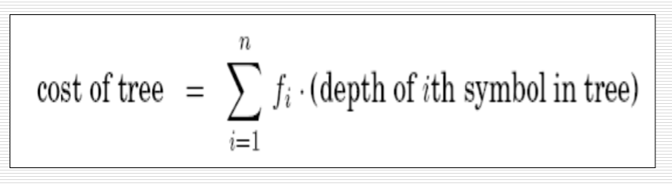

Now, as the algorithm belongs to the greedy paradigm, it has to satisfy *greedy choice property* and the *optimum substructure property*. These are attained as:
- For the greedy choice, note that the symbols with the lowest frequencies must be at the deepest leaves of the tree,ie , children of the lowest node (sublings) , as otherwise, swapping these two with the lowest occuring characters would improve the tree cost, and hence the encoding.

- For optimum substructure property:
    - define the frequency  of an internal node to be the sum of frequencies of its descendant leaves.
    - now, the cost of tree is the sum of frequencies of all leaves and internal nodes. Why?
        - Suppose an internal node has descendant leaves of size f1, f2.
        - Now if the node had n as its bitlength, the leaves are obtained by adding another bit (0 or 1)
        - thus, to account for the entire tree, adding f1,f2 will give the number of *this* extra bit, and defining the frequency of the internal node to be f1+f2 ,recursively climbing the tree will ensure that we do indeed get the entire cost of the tree.

    - A tree with f1,f2 as the lowest sibling leave frequencies has cost (f1+f2) + the cost of tree having leaves of frequency {(f1+f2),f3,f4,...fn} (Effectively, we reduce the tree size and remodel it into a smaller preblem.)
        
        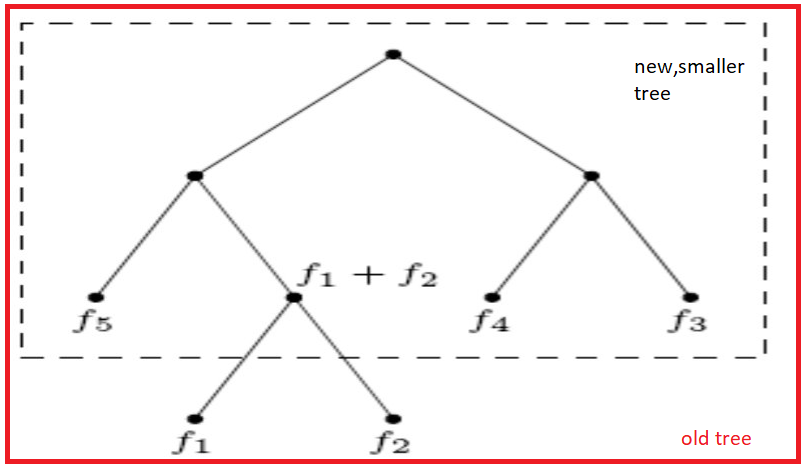

- Thus, both greedy choice property and optimum substructure property is satisfied

The algorithm can be summed up as:
    ```procedure Huffman(f)
    Input: an array of frequencies f[1,2...n]
    output: An encoding tree with n leaves

    get a priority queue (like a heap) H of integers, ordered by f (their frequencies).
    for i = 1 to n
        insert (H,i)
    for k = n+1 to 2n-1
        i = deletemin(H)
        j = deletemin(H) (i and j gives the 2 least frequent nodes)
        create a node numbered k with children as i and j
        f[k]=f[i]+f[j]
        insert(H,k)
    ```

For example, consider a situation as shown below:
<table >
    <tr>
        <th>Character</th>
        <th>Frequency</th>
    </tr>
    <tr>
        <td>a</td>
        <td>5</td>
    </tr>
    <tr>
        <td>b</td>
        <td>9</td>
    </tr>
    <tr>
        <td>c</td>
        <td>12</td>
    </tr>
    <tr>
        <td>d</td>
        <td>13</td>
    </tr>
    <tr>
        <td>e</td>
        <td>16</td>
    </tr>
    <tr>
        <td>f</td>
        <td>45</td>
    </tr>
</table>

1. Build a priority queue (heap) with 6 nodes for the 6 characters.
2. Ge the 2 minimum freq nodes, ie, a and b and add a new internal node with frequency f = 5+9 = 14
    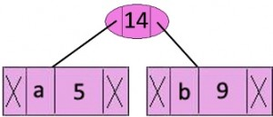

3. Now, the heap contains 6-2+1=5 nodes, as:
<table >
    <tr>
        <th>Character</th>
        <th>Frequency</th>
    </tr>
    <tr>
        <td>c</td>
        <td>12</td>
    </tr>
    <tr>
        <td>d</td>
        <td>13</td>
    </tr>
    <tr>
        <td>IN</td>
        <td>14</td>
    </tr>
    <tr>
        <td>e</td>
        <td>16</td>
    </tr>
    <tr>
        <td>f</td>
        <td>45</td>
    </tr>
</table>
Where IN denotes the internal node<br>
Repeat the steps till each of the characters are popped

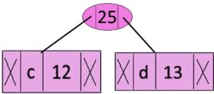

<table >
    <tr>
        <th>Character</th>
        <th>Frequency</th>
    </tr>
    <tr>
        <td>IN</td>
        <td>14</td>
    </tr>
    <tr>
        <td>e</td>
        <td>16</td>
    </tr>
    <tr>
        <td>IN</td>
        <td>25</td>
    </tr>
    <tr>
        <td>f</td>
        <td>45</td>
    </tr>
</table>

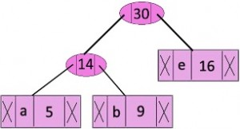

<table >
    <tr>
        <th>Character</th>
        <th>Frequency</th>
    </tr>
    <tr>
        <td>IN</td>
        <td>25</td>
    </tr>
    <tr>
        <td>IN</td>
        <td>30</td>
    </tr>
    <tr>
        <td>f</td>
        <td>45</td>
    </tr>
</table>

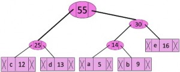

<table >
    <tr>
        <th>Character</th>
        <th>Frequency</th>
    </tr>
        <td>f</td>
        <td>45</td>
    </tr>
    <tr>
        <td>IN</td>
        <td>55</td>
    </tr>
</table>

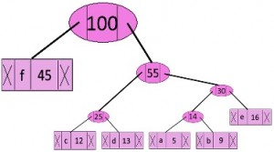

Now, the heap contains only 1 element, and we are done!
While traversing down the tree formed:
- while moving left, write a 0
- while moving right, write a 1 


The codes are:
<table >
    <tr>
        <th>Character</th>
        <th>Code-word</th>
    </tr>
    <tr>
        <td>f</td>
        <td>0</td>
    </tr>
    <tr>
        <td>c</td>
        <td>100</td>
    </tr>
    <tr>
        <td>d</td>
        <td>101</td>
    </tr>
    <tr>
        <td>a</td>
        <td>1100</td>
    </tr>
    <tr>
        <td>b</td>
        <td>1101</td>
    </tr>
    <tr>
        <td>e</td>
        <td>111</td>
    </tr>
</table>

- Time complexity: deletemin() operation is used 2(n-1) times, and it takes O(logn) complexity (heap). Thus, the overall time complexity of this algorithm is O(nlogn)

The Huffman coding can be used for transmitting text and compression of text documents and fax messages. They are also used by conventional compression formats like PKZIP, GZIP, etc. It is useful in cases where there is a series of frequently occurring characters. The Morse code could be a far-fetched idea from the Huffman coding, as the symbols which occur more frequently are given shorter codes in the language.

## 3.2 Run Length Encoding (RLE)
This is another **lossless** compression algorithm which is very famous as it is rather simple and intuitive. The crux of this algorithm is tp represent runs of data (sequences in which the same data value occurs in consecutive data elements) as a single data value and count, rather than as the original run. It is most efficient on data that contains many such runs.

For instance, take the string _aaaaabbbbbbbbccccccddddddddd_. As evident from the string, runs are common in the string. This has a "run" of 5-a's, then 8-b's , 6-c's and 9-d's , so it takes a total of 5+8+6+9 = 28. Using RLE, this can be encoded, thus, as 5a8b6c9d. Notice that now it takes only 8 places (considering the number to take just as much space as a character), which is about a quarter of the size of the uncompressed string.<br> Now, let us take another example: _aaaabcccdeefghijjjklmnop_ (24 spaces). We can see that runs are not so common in this string, but let us proceed as the previous example. The encoding we get by following the same, is `4a1b3c1d2e1f1g1h1i3j1k1l1m1n1o1p` which is 32 spaces long, ie, longer than the uncompressed string. Such a situation is called **negative compression**. 

This can be rectified by using another way to represent the encoding: by using an "escape symbol" to identify runs. For simplicity, let us represent a run of more than 2 a's as aa. By this method, aaaaabbbbbbbbccccccddddddddd can be encoded as `aa5bb8cc6dd9`, which is 12 spaces long- longer than the previous encoding, but still shorter than the uncompressed string. Taking the second example, aaaabcccdeefghijjjklmnop can be encoded as `aa4bcc3deefghijj3klmnop`, which, though has only 1 lesser space than the uncompressed string, has solved the issue of negative compression.

RLE is particularly well suited to palette-based bitmap images such as computer icons For instance, consider the following situations, each of the images have a width of 15px and height of 11 px, thus making a total of 165 pixels, ie, 660 bits (1 pixel= 4 bits):
- example 1:
    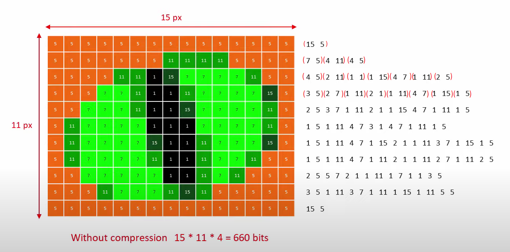

    after compression, we have 134x4 = 536 bits to store

- example 2: consider a simpler version of the same image as example 1:
    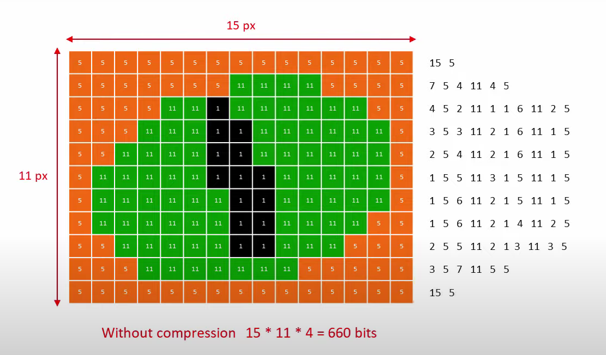

    In this case, we get only 86 values to be stored, and thus, the number of bits to be stored is 86x4 = 344 bits, which is about half the size of the actual uncompressed image.

- example 3: consider a very colourful image with very few runs:
    

    In this one, RLE gives 311 values to store, which totals to 1244 bits, which is about twice the size of the uncompressed file. Thus, this is a case of **negative compression**

Clearly, from the above examples, RLE is not suitable for all types of images. Instead of the way we used above, RLE could read runs across rows as well, but then the decryptor should be given info about the width and height of the image as well. It can also be implemented using columns instead of rows, or even using both columns and rows, and store whatever gave the shorter encoding. RLE by itself is not used in many modern image compression algorithms, because of the run-needy limitation.

Part of the Jpeg compression algorithm divides the picture into 8x8 blocks of pixels, mathematically converting the boxes to tables of brightness and colour information, and then the tables are encoded using RLE, by scanning in a diagonal, zig-zag fashion (its in their nature). An example of such a table is:

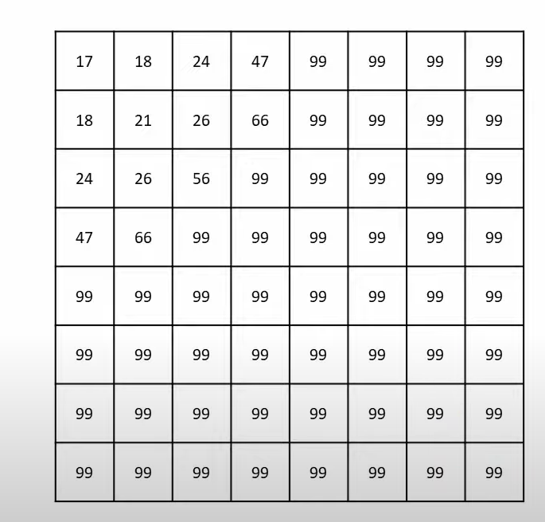


## 3.3 A simple image compression
We are familiar with the format of Jpeg for pictures that we see widely in out devices. Jpeg is an example of **lossy compression**, but it is quite a complex algorithm. For simplicity's sake, let us take a look at a simpler approach to compress images. Even though computers can capture an incredible amount of detail in a photo, can humans actually cannot perceive this much of detail. This is the crux of lossy compression algirithms- figuring out clever ways to remove (to a certain allowable limit) detail without humans noticing (much). 


For our example, let us consider an example of a cat in a hat:<br>
Uncompressed:
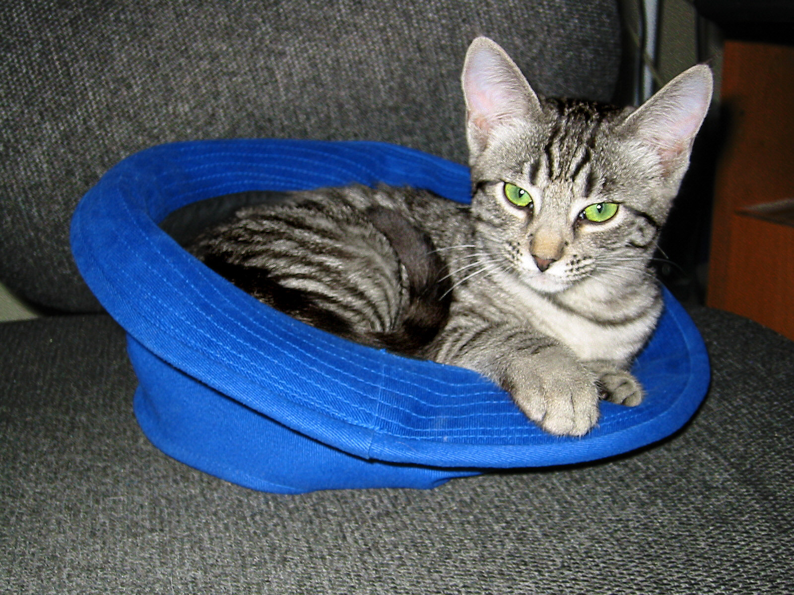

Now here is the same photo, but compressed to half its size:


Ask yourself whether you spotted any difference at your first glance. Well you could go back and try to spot the loss in quality for a while, but isnt it, then, worth it to save half the space? Now lets explore this "simple" image compression algorithm.

Variances in brightness are easier for the human eye to detect than differences in colour. Our "simple" compression algorithm can take advantage of this through **chroma subsampling**, which keeps the brightness the same, while lowering the amount of colour information. For the cat in a hat example above, let us split the photo into brightness-only and chroma-only photos:<br>
Brightness only:
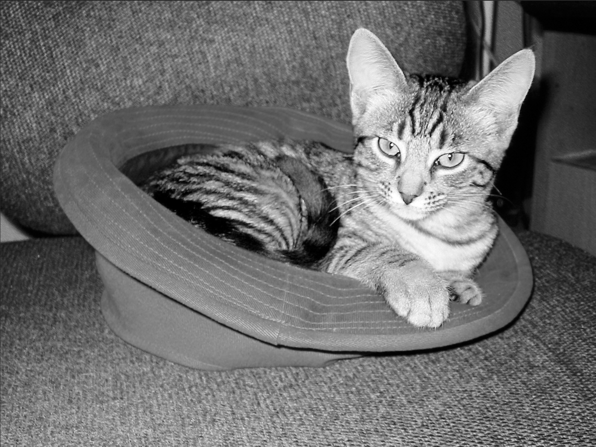

Chroma only:
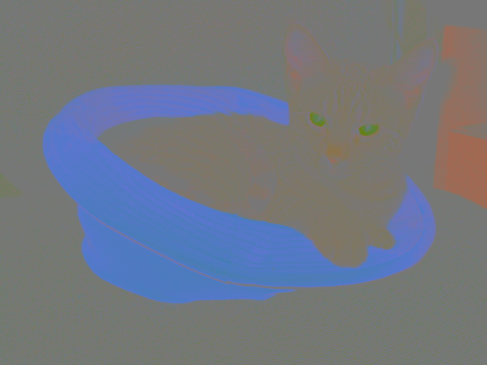

Notice that neither the cat nor the chair hold much colour: the blue hat and the green eyes seems to be the only ones standing out in the chroma only picture. Now, consider and extremely zoomed in, 8x2 block of chroma from the left eye of the cat in the chroma only picture:<br>

<br>Observe that there is _very little_ contrast between closely spaced pixels. Instead of taking all these 16 pixels as is, lets average each 2x2 blocks, and get 4 values in total (16/4)<br>

<br>We can see that this doesnt look _much_ different from the original one, but  in this case we need to store information for only 4 values, instead of 16 in the uncompressed (first) one. Thus, we have reduced the amount of information to be stored to a quarter of the original required space. If we consider the blue hat in the chroma picture, we can see that there are much much bigger runs of almost-same coloured pixels, and thud we can reduce the amount of information we need to store even further. Thus, we have arrived at a simple compression algorithm, based on observation alone!

This process of chroma subsampling is used in many image compression algorithms, including JPEG and MPEG. JPEG (Joint Photographic Experts Group) typically achieves 10:1 compression with little perceptible loss in image quality, and is the most widely used image compression standard. In addition to chroma subsampling, JPEG uses (8x8) <a href="https://en.wikipedia.org/wiki/Discrete_cosine_transform">_Discrete cosine transform_</a>, a zig-zag variant of run length encoding as mentioned in section 3.2 and scalar quantization.