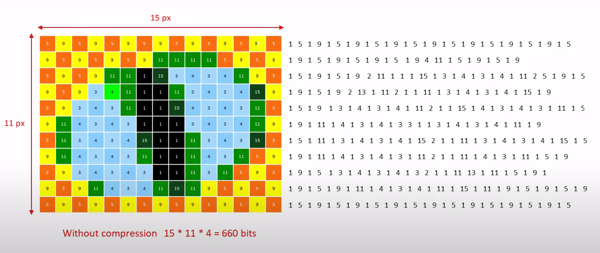
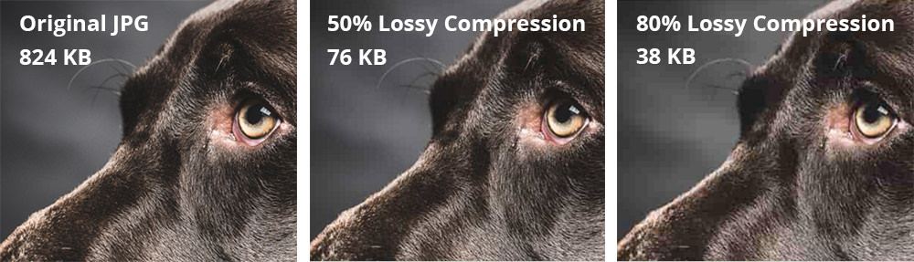
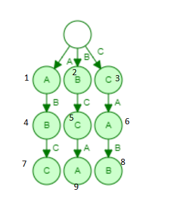

# Chapter 3: A few Compression Algorithms
In this chapter, we will discuss about a few compression algorithms such as the Huffman coding, LZ algorithm, image compression etc, and potential drawbacks and improvements in these algorithms.

## 3.1 Huffman Coding
Huffman coding is a **lossless data compression algorithm**. It is one of the more popular data compression algorithms taught. The goal is to most economically write a given long string (over some alphabet) in binary, ie, _encoding_ it. Consider the English alohabet for instance. We know that some letters like 'e' and 'a' are used more frequently, whereas letters like 'z' and 'x' are comparatively rarer. The main idea of Huffman coding is to **assign lesser bit length strings to charactoers/symbols that appear more frequently in the language. The codes assigned to these are *prefix codes*, to avoid ambiguity (as explained in section 2.3.3). Notice that this encoding may not be unique in the case that two of the characters have the same frequency. This algorithm follows the *greedy* paradigm.

The problem we have can be modelled as: Given frequencies _f<sub>1</sub>,f<sub>2</sub>,...f<sub>n</sub>_ of n characters. we need to make a *tree* such that the *leaves denote the characters*, and minimize the overall length of the encoding. Let us introduce a new term: the **cost** of a tree as the sum of (frequency of a character) x (depth of the character) ie, 


Now, as the algorithm belongs to the greedy paradigm, it has to satisfy *greedy choice property* and the *optimum substructure property*. These are attained as:
- For the greedy choice, note that the symbols with the lowest frequencies must be at the deepest leaves of the tree,ie , children of the lowest node (sublings) , as otherwise, swapping these two with the lowest occuring characters would improve the tree cost, and hence the encoding.

- For optimum substructure property:
    - define the frequency  of an internal node to be the sum of frequencies of its descendant leaves.
    - now, the cost of tree is the sum of frequencies of all leaves and internal nodes. Why?
        - Suppose an internal node has descendant leaves of size f1, f2.
        - Now if the node had n as its bitlength, the leaves are obtained by adding another bit (0 or 1)
        - thus, to account for the entire tree, adding f1,f2 will give the number of *this* extra bit, and defining the frequency of the internal node to be f1+f2 ,recursively climbing the tree will ensure that we do indeed get the entire cost of the tree.

    - A tree with f1,f2 as the lowest sibling leave frequencies has cost (f1+f2) + the cost of tree having leaves of frequency {(f1+f2),f3,f4,...fn} (Effectively, we reduce the tree size and remodel it into a smaller preblem.)
        
        

- Thus, both greedy choice property and optimum substructure property is satisfied

The algorithm can be summed up as:
    ```procedure Huffman(f)
    Input: an array of frequencies f[1,2...n]
    output: An encoding tree with n leaves

    get a priority queue (like a heap) H of integers, ordered by f (their frequencies).
    for i = 1 to n
        insert (H,i)
    for k = n+1 to 2n-1
        i = deletemin(H)
        j = deletemin(H) (i and j gives the 2 least frequent nodes)
        create a node numbered k with children as i and j
        f[k]=f[i]+f[j]
        insert(H,k)
    ```

For example, consider a situation as shown below:
<table >
    <tr>
        <th>Character</th>
        <th>Frequency</th>
    </tr>
    <tr>
        <td>a</td>
        <td>5</td>
    </tr>
    <tr>
        <td>b</td>
        <td>9</td>
    </tr>
    <tr>
        <td>c</td>
        <td>12</td>
    </tr>
    <tr>
        <td>d</td>
        <td>13</td>
    </tr>
    <tr>
        <td>e</td>
        <td>16</td>
    </tr>
    <tr>
        <td>f</td>
        <td>45</td>
    </tr>
</table>

1. Build a priority queue (heap) with 6 nodes for the 6 characters.
2. Ge the 2 minimum freq nodes, ie, a and b and add a new internal node with frequency f = 5+9 = 14
    

3. Now, the heap contains 6-2+1=5 nodes, as:
<table >
    <tr>
        <th>Character</th>
        <th>Frequency</th>
    </tr>
    <tr>
        <td>c</td>
        <td>12</td>
    </tr>
    <tr>
        <td>d</td>
        <td>13</td>
    </tr>
    <tr>
        <td>IN</td>
        <td>14</td>
    </tr>
    <tr>
        <td>e</td>
        <td>16</td>
    </tr>
    <tr>
        <td>f</td>
        <td>45</td>
    </tr>
</table>
Where IN denotes the internal node<br>
Repeat the steps till each of the characters are popped


<table >
    <tr>
        <th>Character</th>
        <th>Frequency</th>
    </tr>
    <tr>
        <td>IN</td>
        <td>14</td>
    </tr>
    <tr>
        <td>e</td>
        <td>16</td>
    </tr>
    <tr>
        <td>IN</td>
        <td>25</td>
    </tr>
    <tr>
        <td>f</td>
        <td>45</td>
    </tr>
</table>


<table >
    <tr>
        <th>Character</th>
        <th>Frequency</th>
    </tr>
    <tr>
        <td>IN</td>
        <td>25</td>
    </tr>
    <tr>
        <td>IN</td>
        <td>30</td>
    </tr>
    <tr>
        <td>f</td>
        <td>45</td>
    </tr>
</table>


<table >
    <tr>
        <th>Character</th>
        <th>Frequency</th>
    </tr>
        <td>f</td>
        <td>45</td>
    </tr>
    <tr>
        <td>IN</td>
        <td>55</td>
    </tr>
</table>


Now, the heap contains only 1 element, and we are done!
While traversing down the tree formed:
- while moving left, write a 0
- while moving right, write a 1 


The codes are:
<table >
    <tr>
        <th>Character</th>
        <th>Code-word</th>
    </tr>
    <tr>
        <td>f</td>
        <td>0</td>
    </tr>
    <tr>
        <td>c</td>
        <td>100</td>
    </tr>
    <tr>
        <td>d</td>
        <td>101</td>
    </tr>
    <tr>
        <td>a</td>
        <td>1100</td>
    </tr>
    <tr>
        <td>b</td>
        <td>1101</td>
    </tr>
    <tr>
        <td>e</td>
        <td>111</td>
    </tr>
</table>

- Time complexity: deletemin() operation is used 2(n-1) times, and it takes O(logn) complexity (heap). Thus, the overall time complexity of this algorithm is O(nlogn)

The Huffman coding can be used for transmitting text and compression of text documents and fax messages. They are also used by conventional compression formats like PKZIP, GZIP, etc. It is useful in cases where there is a series of frequently occurring characters. The Morse code could be a far-fetched idea from the Huffman coding, as the symbols which occur more frequently are given shorter codes in the language.

## 3.2 Run Length Encoding (RLE)
This is another **lossless** compression algorithm which is very famous as it is rather simple and intuitive. The crux of this algorithm is tp represent runs of data (sequences in which the same data value occurs in consecutive data elements) as a single data value and count, rather than as the original run. It is most efficient on data that contains many such runs.

For instance, take the string _aaaaabbbbbbbbccccccddddddddd_. As evident from the string, runs are common in the string. This has a "run" of 5-a's, then 8-b's , 6-c's and 9-d's , so it takes a total of 5+8+6+9 = 28. Using RLE, this can be encoded, thus, as 5a8b6c9d. Notice that now it takes only 8 places (considering the number to take just as much space as a character), which is about a quarter of the size of the uncompressed string.<br> Now, let us take another example: _aaaabcccdeefghijjjklmnop_ (24 spaces). We can see that runs are not so common in this string, but let us proceed as the previous example. The encoding we get by following the same, is `4a1b3c1d2e1f1g1h1i3j1k1l1m1n1o1p` which is 32 spaces long, ie, longer than the uncompressed string. Such a situation is called **negative compression**. 

This can be rectified by using another way to represent the encoding: by using an "escape symbol" to identify runs. For simplicity, let us represent a run of more than 2 a's as aa. By this method, aaaaabbbbbbbbccccccddddddddd can be encoded as `aa5bb8cc6dd9`, which is 12 spaces long- longer than the previous encoding, but still shorter than the uncompressed string. Taking the second example, aaaabcccdeefghijjjklmnop can be encoded as `aa4bcc3deefghijj3klmnop`, which, though has only 1 lesser space than the uncompressed string, has solved the issue of negative compression.

RLE is particularly well suited to palette-based bitmap images such as computer icons For instance, consider the following situations, each of the images have a width of 15px and height of 11 px, thus making a total of 165 pixels, ie, 660 bits (1 pixel= 4 bits):
- example 1:
    

    after compression, we have 134x4 = 536 bits to store

- example 2: consider a simpler version of the same image as example 1:
    

    In this case, we get only 86 values to be stored, and thus, the number of bits to be stored is 86x4 = 344 bits, which is about half the size of the actual uncompressed image.

- example 3: consider a very colourful image with very few runs:
    

    In this one, RLE gives 311 values to store, which totals to 1244 bits, which is about twice the size of the uncompressed file. Thus, this is a case of **negative compression**

Clearly, from the above examples, RLE is not suitable for all types of images. Instead of the way we used above, RLE could read runs across rows as well, but then the decryptor should be given info about the width and height of the image as well. It can also be implemented using columns instead of rows, or even using both columns and rows, and store whatever gave the shorter encoding. RLE by itself is not used in many modern image compression algorithms, because of the run-needy limitation.

Part of the Jpeg compression algorithm divides the picture into 8x8 blocks of pixels, mathematically converting the boxes to tables of brightness and colour information, and then the tables are encoded using RLE, by scanning in a diagonal, zig-zag fashion (its in their nature). An example of such a table is:


## 3.3 A simple image compression
We are familiar with the format of Jpeg for pictures that we see widely in out devices. Jpeg is an example of **lossy compression**, but it is quite a complex algorithm. For simplicity's sake, let us take a look at a simpler approach to compress images. Even though computers can capture an incredible amount of detail in a photo, can humans actually cannot perceive this much of detail. This is the crux of lossy compression algirithms- figuring out clever ways to remove (to a certain allowable limit) detail without humans noticing (much). 



For our example, let us consider an example of a cat in a hat:<br>
Uncompressed:


Now here is the same photo, but compressed to half its size:


Ask yourself whether you spotted any difference at your first glance. Well you could go back and try to spot the loss in quality for a while, but isnt it, then, worth it to save half the space? Now lets explore this "simple" image compression algorithm.

Variances in brightness are easier for the human eye to detect than differences in colour. Our "simple" compression algorithm can take advantage of this through **chroma subsampling**, which keeps the brightness the same, while lowering the amount of colour information. For the cat in a hat example above, let us split the photo into brightness-only and chroma-only photos:<br>
Brightness only:


Chroma only:


Notice that neither the cat nor the chair hold much colour: the blue hat and the green eyes seems to be the only ones standing out in the chroma only picture. Now, consider and extremely zoomed in, 8x2 block of chroma from the left eye of the cat in the chroma only picture:<br>

<br>Observe that there is _very little_ contrast between closely spaced pixels. Instead of taking all these 16 pixels as is, lets average each 2x2 blocks, and get 4 values in total (16/4)<br>

<br>We can see that this doesnt look _much_ different from the original one, but  in this case we need to store information for only 4 values, instead of 16 in the uncompressed (first) one. Thus, we have reduced the amount of information to be stored to a quarter of the original required space. If we consider the blue hat in the chroma picture, we can see that there are much much bigger runs of almost-same coloured pixels, and thud we can reduce the amount of information we need to store even further. Thus, we have arrived at a simple compression algorithm, based on observation alone!

This process of chroma subsampling is used in many image compression algorithms, including JPEG and MPEG. JPEG (Joint Photographic Experts Group) typically achieves 10:1 compression with little perceptible loss in image quality, and is the most widely used image compression standard. In addition to chroma subsampling, JPEG uses (8x8) <a href="https://en.wikipedia.org/wiki/Discrete_cosine_transform">_Discrete cosine transform_</a>, a zig-zag variant of run length encoding as mentioned in section 3.2 and scalar quantization.

## 3.4: Audio compression
Traditional lossless compression methods (Huffman, LZW, etc.) usually don't work well on audio compression, and hence, **lossy compression methods** are generally used. Similar to the example of image compression, there is a threshold to what the human ear can distinguish as well. Just like before, we take advantage of this to analyze an audio file and discard the sounds that are outside of our hearing capacity (this process is known as perceptual audio coding). Another interesting fact is that sudden sounds can mask other sounds for a period after it occurs (you probably observe this in diwali while bursting crackers, the ringing sound that fades after a while). This is known as _temporal masking_. Even though we might not be able to hear the sounds during this while, the computer sees those _hidden sounds_. So audio compression algorithms can safely discard that information or represent it with fewer bits. 

Compression algorithms can also use the frequency limits of human ear to further mask off the sounds that exceed these limits. Some general, simple methods of audio compression besides the above method are:
- **Silence Compression**: This method provides a way to squeeze redundancy out of sound files.
    - It is equivalent to run length coding on normal data files. Here, the runs we encode are sequences of relative silence in a sound file. This is a lossy technique because we replace the sequences of relative silence with absolute silence
    - For this method, certain parameters are used, like:
        - Some threshold value to indicate the start of a silence run, and an end of one.
        - A threshold value that specifies, below which the compression can be considered as silence.
        - A silence code followed by a single byte, which indicates the numbers of consecutive silence codes are present. (RLE equivalence)
    - As seen in the example for RLE, to avoid negative compresison, we may have to modify the code to signify only runs of length three or more.
    - It allows a significant reduction of transmission bandwidth during silence period where only background noises are transmitted.

- **DPCM and ADPCM(Adaptive)**: Differential pulse-code modulation is a signal encoder that uses digitally represented sampled analog signals and adds some functionalities based on the prediction of the samples of the signal.
    - Two consecutive sample values are taken in, quantized, and the difference between the two is caluclated. This difference is then outputted
    - Doing this reduces the short-term redundancy of the signal
    - Using **entropy coding**(Similar to Huffman coding. The length of each codeword is approximately proportional to the negative log of the probability of occurrence of that codeword), this algorithm can be coded to further increase the compression ratio.
    - ADPCM is a version of DPCM that reduces the necessary data bandwidth for a given signal-to-noise ratio by varying the size of the quantization step (adapts at quantization so fewer bits are used when the value is smaller).
    - Apple has proprietary scheme called ACE/MACE. This is a lossy scheme that tries to predict where wave will go in next sample. It has a compression ratio of about 2:1.

- **Linear Predictive Coding (LPC)**: It is one of the most widely used speech coding algorithm
    - It uses a linear predictive model to get the predicted outcome of a waveform, and represents the spectral envelope of a digital signal of speech in compressed form. 
    - LPC analyzes the speech signal by estimating the formants, removing their effects from the speech signal, and estimating the intensity and frequency of the remaining buzz. 
    - The process of removing the formants is called **inverse filtering**, and the remaining signal after the subtraction of the filtered modeled signal is called the **residue**.
    - LPC uses the buzz parameters and the residue to create a source signal, and uses the formants to create a filter .
    - This can be visualised as speech is being produced (buzz) at one end of a tube (formant filter)
    - Speech signals may vary greatly with time, and hence, LPC is done in small packets of speech signals (frames). Around 30-50 frames per second gives speech that is comprehensible and well compressed.

## 3.5 LZW Compression
LZW compression is the compression of a file into smaller file using a table-based lookup algorithm. It was invented by Abraham ****L**empel, Jacob **Z**iv, and Terry **W**elch. It is an **adaptive model**, ie, it progressively learns and updates as you read data (kind of like artificial intelligence). LZW algorithm is widely used in GIF image format and TIFF image format. It is also suitable for text files. It is a **lossless** compression algorithm.

Let us take an example to illustrate how this algorithm encodes a given string. Consider the string `abcabcabcabcabc`. Let us try to understand how the algorithm works on this string. We start with an empty dictionary {}, and encoding [ ] . Now, since the dictionary is empty, and the first character is read, we read `a` and store it into the dictionary by, say {"a":1} and encode it as [ 1 ]. Now, we check the next character, `b` and add this to the dictionary as well, {"a":1,"b":2}, [ 1 2 ]. Similarly, since c is also not in the dictionary, {"a":1,"b":2,"c":3}, [ 1 2 3 ]. Next, we our index points to a, but a is already in the dictionary (ie, we know how to encode a), so read another character without encoding it, and add the pair `ab` to the dictionary, as abca`b`cabcabcabc {"a":1,"b":2,"c":3, "ab":4}, [ 1 2 3 1 ] (currently the index points to b, ie, b is to be read next). Now, since b is already in dictionary, as we've done in the earlier case, we add `bc` to the dictionary and get {"a":1,"b":2,"c":3, "ab":4, "bc":5}, [ 1 2 3 1 2 ]. Similarly, next we get `ca`, as {"a":1,"b":2,"c":3, "ab":4, "bc":5, "ca":6}, [ 1 2 3 1 2 3 ] and the string is now abcabc`a`bcabcabc. Next, we read a, then ab, both of which are in the dictionary, so we read the string `abc` into the dictionary and encode `ab`: {"a":1,"b":2,"c":3, "ab":4, "bc":5, "ca":6,**"abc":7**}, [ 1 2 3 1 2 3 **4**]. abcabcab`c`abcabc: c and ca are in dictionary, so we read `cab`, encode `ca` and move pointer to b as abcabcabca`b`cabc, {"a":1,"b":2,"c":3, "ab":4, "bc":5, "ca":6, "abc":7, **"cab":8**}, [ 1 2 3 1 2 3 4 **6** ]. Next, since b and bc are in the dict, we add `bca` to the dictionary, encode `bc` and more the pointer to a as abcabcabcabc`a`bc, {"a":1,"b":2,"c":3, "ab":4, "bc":5, "ca":6, "abc":7, "cab":8, **"bca":9**}, [ 1 2 3 1 2 3 4 6 **5** ]. Next, we see that `abc` is already in the dictionary, and the string has ended, so we encode `abc` as 7 to get [ 1 2 3 1 2 3 4 6 5 **7** ]. Thus, our entire string has been encoded: `abcabcabcabcabc` has been encoded as `1231234567`, which has reduced the number of values to be stored from 15 to 10, ie, 1.5 compression ratio, for a small string like this. Since this is an adaptive model, it can be used for much bigger strings and give better compression ratios.

The encoding algorithm can be summarised as:
    
    ```
    LZW encoding
    1. create a symbol table (ST) associating W-bit codewords with string keys
    2. initialise the ST with codewords for single characters
    3. Find the longest string s in ST that is a prefix of unscanned part of the input string.
    4. Write the W-bit codeword for s in the encoding to be sent
    5. add the string s'=s+c, where c is the left-out next character from the input string to the ST
    6. go back to step 3 till all characters in the input string has been read
    7. output the encoding
    ```

An LZW compression code table can also be represented by using a **trie** data structure.  


<br> As the trie gets deeper, we get better compression, as we are encoding more number of characters with a codeword

One of the main advantages of this method is that we dont have to send the dictionary to the decoder: the decoder, too makes such a lookup table on the get-go. (decoder has the dictionary for single characters). The decoding/ expansion algorithm is also similar to the decoding:

    ```
    LZW decoding
    1. create a symbol table (ST) associating W-bit codewords with string keys
    2. initialise the ST with codewords for single characters
    3. Read a W-bit key
    4. Find the associated string value from ST and write it out
    5. Update the ST
    6. go back to step 3 till all characters in the input string has been read
    7. output the decoded string
    ```
<br>For the decoded, the lookup table can be stored simply as a string array

GIF format uses LZW method of compression. In this format, the symbol table is thrown away and the compressioon starts over when the symbol table fills up. Other compressions, like the Unix compression throws the symbol table away only when it is no longer effective. As we can probably guess, this algorithm doesnt yeild much compression if there are not enough repeated runs: it may even lead to negative compression in case we start with a wrong dictionary (ST).

> Even though most compreission algorithms explained are really well defined and give good compression ratios, these individually are not used in the daily life, rather, a mixture of the explained algorithms are used in our computers for compression like JPEG, MPEG, ZIP etc. 

> For LZW, or for much of the lossless compression algorithms in general, it is possible to generate an input or test case such that the encoded file is almost the same size as, or maybe even bigger than the un-compressed file (negative compression). A trivial example is when there are no recurring runs: any run-length encoding algorithm will struggle to get any progress in compression. Lossy compression on the other hand, permits the loss of data to a certain threshold, and _may_ overcome this situation, but in cases where loss of data is not allowed, there is nothing we can do. In short, **there is no perfect compression algorithm** till date: every compression algorithm has a trade-off.

## Conclusion
Throughout this book, we have learnt what compression is, how compression could be understood better, and paved a way for even a beginner programmer to understand various aspects of compression and different important compression algorithms. Compression algorithms is still an area of widespread research, as it is extremely important in this era where people use more than a trillion MB per day. 