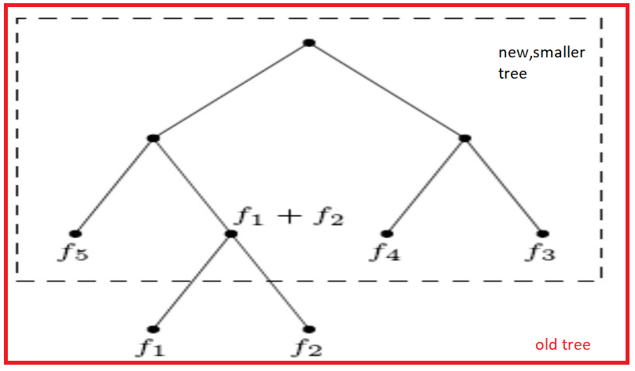
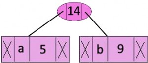
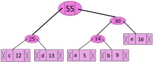
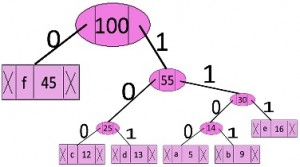
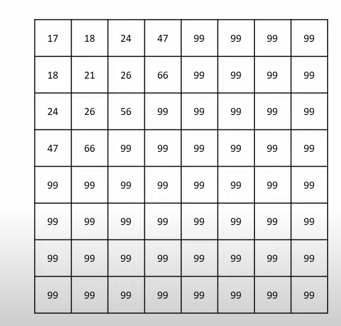
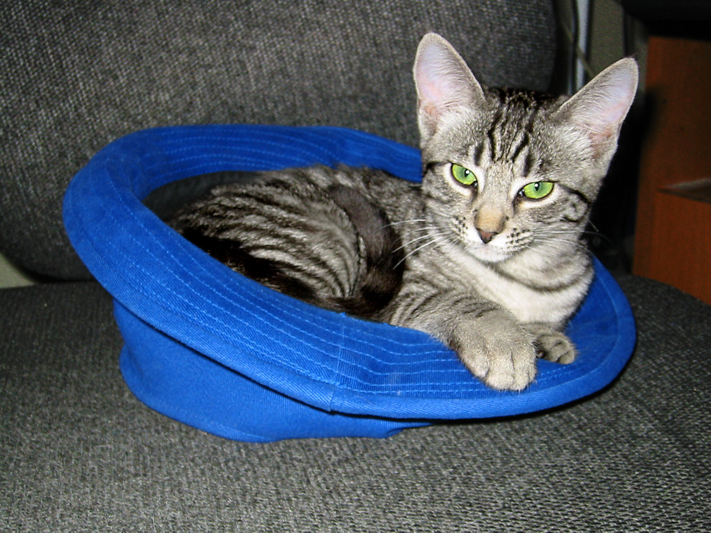
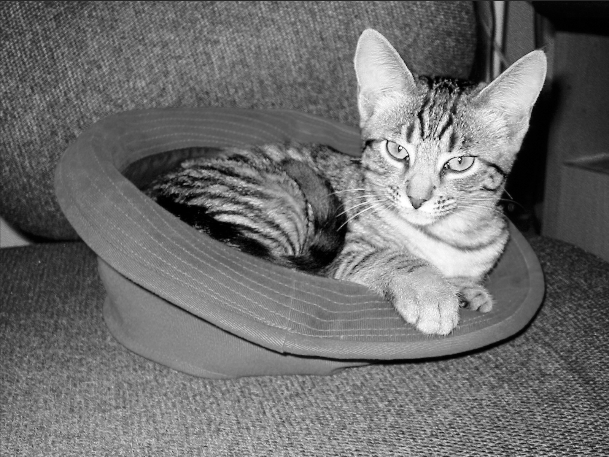

# Chapter 1 : The beginning

## 1.1 What _is_ an algorithm
Say you are on a road trip with your friends, somewhere far far away. Your goal is simple: get to the destination safely. Now you are pretty sure you are lost, so you decide to open your window and ask a bystander for the way to your destination (lets just say you had no reception for your google maps). The guy tells you which path to go in, what turns to make, quite often with some landmarks to ensure you get it right. You follow whatever <i>instructions</i> he gave you, and arrive at your destination, safe and sound, thus, fulfilling your goal.

Now lets think about this from a different approach. Your goal (problem at hand) was to reach the destination. You were given the instructions (rules) to follow to reach the destination. Finally, you reach the destination (problem solved!). This is what an <i>algorithm</i> is.

In short, an algorithms is a set of rules or instructions to be followed for doing a calculation, or solving a problem. Here, the instructions given by the bystander is the algorithm: not following this, or even changing the order of these instruction may lead to you not reaching the destination. 

## 1.2 How to compare algorithms
Taking the same example of giving directions, suppose there are two routes leading to your destination: one being longer than the other. Keep in mind that the shorted route and the longer route have a different set of instructions, or, as we formally defined, algorithms. Usually, we prefer to take the shortest route to the destination. But it is also possible that the longer route is more well-built. Thus, if we are in a hurry, we might choose the shorter one, but those who value comfort over speed would prefer the longer route.

There are many ways to compare algorithms. The primary comparison is based on two factors:
- time taken for the algorithm to solve the problem, a.k.a time complexity
- space complexity

### 1.2.1 Time complexity
As the name suggests, it has to do with the time taken by the algorithm to solve the problem. In the above example, in terms of _time_, the shorter path might be the way to go, and hence, a person in a hurry (or not) prefers to use the shorter path. Formally, time complexity is the amount of time taken by an algorithm to run, as a function of the length of the input. It is denoted by O(t) , which is called the "Big-O" notation. In general, an algorithm with time complexity O(t<sub>1</sub>) is better than an algorithm with time complexity O(t<sub>2</sub>), when t<sub>1</sub> < t<sub>2</sub> (by better, it just means that it has a quicker solving time)

### 1.2.2 Space complexity
Again, from the name, it has to do with the space taken by the algorithm to solve the problem. Formally space complexity is a measure of how efficient your code is in terms of memory used, with respect to input size. Similar to time complexity, an algorithm with space complexity O(s<sub>1</sub>) is better than an algorithm with space complexity O(s<sub>2</sub>), when s<sub>1</sub> < s<sub>2</sub> (by better, it just means that it has a lesser space requirement for the same input). (it is also represented in the big O notation)

Ideally, a good algorithm must have low time as well as space complexity. Unfortunately, such an algorithm seldom exists in the real world, and the choice of which algorithm to use depends largely on what/where it is being used. For instance, consider sorting algorithms. Selection sort and merge sort are among the famous sorting algorithms. Selection sort has a time complexity of O(N<sup>2</sup>) and a space complexity of O(1) [O(1) means constant, and is independent of the size of the input], where N is the number of elements to be sorted. Merge sort has a time complexity of O(NlogN) and a space complexity of O(N). Suppose we have a large number of elements to be sorted (large N). Then, if we run the sorting on a system with very limited memory, we have to use selection sort, as it has a lesser memory need (space complexity) than mergesort, and when we want the sorting to be done fast, we use mergesort, by compromising on memory. Thus, there is most often a compromise on which algorithm to use to solve a problem.

## 1.3 Algorithmic Paradigms
All of us might probably have found an instance of where multiple ways of thinking helped different people to solve a same problem, or to arrive at the same conclusion. A very common example is math ,where there is "no one particular method" to arrive at the answer. A person who has no depth in integration, but is well versed in differentiation, can obtain the answer for a multiple choice question by differentiating all the options provided, and still get the same answer as a guy who used actual integration to solve the question.

Any basic, commonly used approach in designing algorithms could be considered an algorithmic paradigm. Formally, an algorithmic paradigm or algorithm design paradigm is a generic model or framework which underlies the design of a class of algorithms. 

For instance, we have a letter to be delivered to a specific locker. Now, the letter only has the name of the person it has to be delivered to, and there are many lockers. One way of delivering the letter, would be to manually go through the locker room, checking each locker to see a name that fits the letter. This particular "paradigm" is called **Brute Force** paradigm, which is systematically enumerating all possible candidates for the solution and checking whether each candidate satisfies the problem's statement. Another example is guessing the password of an iphone: we might have to try all the 10<sup>4</sup> combinations for the 4 digits.

Now, say 2 of our friends arrived to our aid. We can split up the locker room into 3 sections, and send one person to each section. This way, the amount of work done by one person reduces, and takes a lesser amount of time to cover more lockers (3 times faster, obviously). This way of dividing the problem at hand to smaller subproblems, and solving them recursively is called **Divide and conquer**. Mergesort is an excellent example of this paradigm.

There are a variety of other algorithm paradigms, like the **greedy method** (Find solution by always making the choice that looks optimal at the moment- don’t look ahead, never go back. As we shall learn later, the Huffman coding is a greedy algorithm), **Dynamic programming**, **sliding window paradigm** (an array, for example, is divided into a subarray. The subarray is visualized like a sliding window as it movies from one end of the array to another. The LZ algorithm, as we shall see later, belongs to this category.) etc.

## 1.4 Summary
By the end of this chapter, the reader must be familiar with the basics regarding algorithms, how to compare algorithms and a few important algorithm paradigms.


# Chapter 2 : Compression

In this chapter, we dive into the realm of compression starting from what exactly compression means and why it should be used. Then we are introduced into the various terminologies that are commomly used to describe more about the different compression algorithms. We also look into the two broad divisions of compression algorithms. Finally, we try to give an introduction on how to compare different compression algorithms.

## 2.1 What is compression

Let us continue with our example: the road trip. There are two bystanders to which you can ask the route- one is a prodigy and tells each of the multiple routes to your destination, and another knows the best/shortest route to the destination. Obviously, any normal person will get confused on hearing the entire lists of route he can take, and will probably end up getting lost again. The other guy, on the other hand, suggests the best route, and hence, is more often the preferred choice, as he too has decided the optimum route after considering all the routes.

Irrespective of who gives us the route, we generally choose the best route of the mentioned ones, and thus, the two bystanders effectively convey the same information. Thus, bystander 2 has conveyed the same information as bystander 1, while talking less (or consuming less of our memory space, lets say). In short, route by bystander 2 is the *compressed* form of whatever bystander 1 said.

Consider another example: the reader probably knows, and prefers the use of π as 3.14, and not as 3.14159265358... , and speed of light as 3 x 10<sup>8</sup> m/s, and not 299792458 m/s. Formally, **compression refers to conversion (of data, a data file, or a communications signal) in order to reduce the space occupied or bandwidth required**. Compression is normally used to reduce the size of data/file without removing information.

With the advent of technology, more and more exchange and storage of data came to be, and as storage of this data is somewhat costly, the search for better and better ways of compression began to be carried out. This search branched out into different fields, such as data compression, signal compresson etc, and hence, compression is now a very vast, disjoint branch.

Recall from chapter 1 that there are different algorithm paradigms (commonly used approach in designing algorithms). The goal of compression is one: to *compress* the data/file, ie, to reduce the space taken by it, and since it is not a way of designing an algorithm, compression is not a paradigm. Rather, it is a different field in computer science. The different algorithms used for different kinds of compression use different algorithm paradigms like the ones mentioned in chapter 1.

## 2.2 Why compression

As mentioned above, the need of compression is quite obvious
    - To save *space* while storing data
    - To save *time* while transmitting it
    - Most files have a lot of redundant content, and hence, if these can be "comdensed" into a simple representation (lets call it a black box) then it is much easier to store as well as understand.

For example, we know that a movie (1080p) takes around 2gb (not considering bluray). But an uncomressed 1080p 8-bit video requires about 10gb *per minute*. This means that an average movie will take up 1200gb, ie, more than 1TB space. Similarly, the pictures we save in our galleries (jpg or png) are compressed, and not actually the RAW files, which takes up a lot more space. In the modern era, where facetime, skype and other video conferencing is now more preferred than a phonecall, compression is extremely important.

## 2.3 Some terminologies used in compression

### 2.3.1 Self information and entropy

This was a term coined by Shannon. Suppose we have an event A whose probability of occurence is P(A). Then, _Self information_ of A is given by <br>

> *i(A) = - log<sub>b</sub>P(A)*

where b can be 2 (unit is bits), e (unit is nats) or 10 (unit is hartleys). In general, we take b as 2.
As we know that -log(x) is larger for an x that is closer to 0 in the interval (0,1). Thus, **if the probability of an event is low, the amount of self information associated with that event is high** , and vice versa.

Now, consider we have a set of independent events *A<sub>i</sub>*, and sample space S is the union of all these events. The average self information associated with some random experiment is then given by:

> H = Σ P(A<sub>i</sub>) x i(A<sub>i</sub>) = -Σ P(A<sub>i</sub>) x log<sub>b</sub>P(A<sub>i</sub>)

This quantity is called the **entropy** of the experiment. In other words, entropy is a **measure of the average number of binary symbols needed to code the output** of the experiment.

> For example, consider the binary sequences 000000 and 010101.
>
> 1. in 000000 , P(0)=1, and thus, entropy H = -1logl = 0. Entropy is 0, as we dont need any information to represent which symbol is next in the series, as the series contains only 0s.
> 2. in 010101 , p(0)=P(1)=0.5, and thus, H= -(0.5log0.5 + 0.5log0.5) [taking base as 2,] = -(-1) = 1. Since base is 2, we get that we need an average of 1 bit to represent each character in the string (which is true)

### 2.3.2 Models

Designing the data into a good model can be helpful in constructing efficient compression techniques for the data. Some commonly used models are:

- **Physical model**: Used when we know the _physics_ of the data generation process. An example is speech compression, as knowledge about the physics of speech production can be used to construct a mathematical model for the sampled speech process, and sampled speech can be encoded using this model. (In general, however, the physics of data generation is too complicated to understand, and hence we cannot make such models).

- **Probability model**: Keep the independence assumption and assign probabilities to each letter of the alphabet. Using the probability model, we can construct some very efficient codes to represent the letters in the alphabet . However, these codes are only efficient if our mathematical assumptions are in line with reality.

- **Markov model**: For models used in lossless compression, we use a specific type of Markov process called a *discrete time Markov chain*:
  - Let {x<sub>i</sub>} be the sequence of observations, then the sequence follows k-th order Markov model if<br> P(x<sub>n</sub>|x<sub>n-1</sub>,....,x<sub>n-k</sub>) = P(x<sub>n</sub>|x<sub>n-1</sub>,....,x<sub>n-k</sub>,...)
  - This can be stated as: knowledge of the past k symbols is equivalent to the knowledge of the entire past history of the process
  - Most commonly used Markov model is first order Markov model, ie,  P(x<sub>n</sub>|x<sub>n-1</sub>) = P(x<sub>n</sub>|x<sub>n-1</sub>,x<sub>n-2</sub>,x<sub>n-3</sub>,...)

Markov models are particularly useful in text compression where the probability of the succeeding letter is greatly influenced by the preceding letters.

- Oftentimes, it is not easy to use a single model to describe the source. In such cases, we can define a *composite source*, which can be seen as a combination of several sources, with only one source being active at any given time

### 2.3.3 Coding

Coding is the process of assignment of binary sequences to letters of an alphabet. The set of binary sequences is called a code, and each individual members of the set are called codewords. A trivial example of coding can be taken from the ASCII code of the English alphabet: A is 1000001, and that of a is 1000011. ASCII also contains codes for certain characters like "," (comma, ascii is 0011010). Each ASCII codeword has a fixed, same number of bits, and thus, ASCII is an example of **fixed length code**. 

More often than not, we use lesser number of bits to represent those letters that occur more frequently than others (as reducing the number of bits required, and hence the memory required is the cruz of compression in the first place). The average number of bits per symbol is called the **rate** of the code. A typical example that uses this idea is the Morse code (you probably already know what it is from spy and action movies :) ) in which the codewords that occur more frequently are shorter (E is `·`, while Z is `—··`)

To be useful, a code should not only reduce the length of encoding, but also have the ability to transfer information in an unambiguous manner. Consider the following 3 encodings of the same letters:


(Average length is given by ΣP(a<sub>i</sub>)n(a<sub>i</sub>) , n(a<sub>i</sub>) is the number of bits in the codeword of a<sub>i</sub>)

Sheerly based on average length, Code 1 is no doubt the best one. However, consider a string 00. This can be decoded by the user as a1a1,a1a2,a2a1 or a2a2, and the user cannot identify which is the intented information that should be recieved. Hence, Code 1 is ambiguous<br> Now, consider Code 2. Here too, a string 000 may mean a1a1a1, a1a3 or a3a1, and thus 2 is also ambiguous.

Now, consider the Code 3. Notice that except for a4, all the codewords end in 0 (ie, 0 deonotes the end of a codeword), and a4 is the only one with 3 1-s. In other words, the only way to get 3 1-s in a row is to have an a4. Thus, the decoding can be done as: accumulate bits until you get a 0, or 3 1-s. Thus, there is no ambiguity in Code 3, and it is **uniquely decodable**. In the case of Code 3, the decoder knows the moment a code is complete which character is to be decodedm and this property makes Code 3 an **instantaneous code**. (Keep in mind that this is not a requirement for unique decodability)

Keep in mind that this is not always the case. For instance, consider the binary string 0101010 and the alphabet as:


two valid decodings are a1a3a3a3, and a2a2a2a1 .<br>Now, for the same alphabet, consider the string 01010101. If the first 0 is decoded as a1, we try the encoding, as a1a3a3a3, and we are left a bit 1 in the end. This bit is called dangling bit. A valid decoding for this is a2a2a2a2. thus, the string can be uniquely decoded.

A code in which no codeword is a prefix of the other is a code in which we will never have to deal with the prospect of a dangling suffix becoming a codeword. We don't have to worry about discovering a dangling suffix that is identical to a codeword because the set of dangling suffixes is the null set in this case. A **prefix code** is one in which no codeword is a prefix to another codeword. A simple way to check if a code is a prefix code is to draw the rooted binary tree corresponding to the code. If it is a prefix code, only the leaves of the tree will have codewords.

## 2.4 Compression techniques

Compression is not a 1 step process; rather it is considered to have 2 steps: compression algorithm that takes an input X and gives an output X', and a reconstruction algorithm that operates on this X' to create an output Y. 


Based on the reconstruction requirements, compression schemes are divided into 2 main categories: lossless compression (X and Y are identical) and lossy compression(greater degree of compression than lossless, but allows Y to differ from X).

### 2.4.1 Lossless compression

As the name suggests, this meathod involves no loss of data. The original data can be recovered as was from the compressed data if data has been losslessly compressed. Lossless compression is typically utilised in situations where any difference between the original and reconstructed data is unacceptable. An example is text compression, where even a minute change can lead to misinterpretations. Data from archaeological sites, for instance, if compressed lossily, even though changes may not be detected on reconstruction, may lead to fake information on further enhancing (which they do). Satellite images, have to be enhanced to detect various information about outer space, and this too, if not reconstructed as it was trnsmitted leads to fake information, and oftentimes it might be impossible to get the sample data again within reasonable periods of time.<br>The LZ algorithms and huffmann coding are examples of lossless compression algorithms.

### 2.4.2 Lossy compression

As indicated by the name, this techniques involve some loss of information, and data that have been compressed using lossy techniques generally cannot be recovered or reconstructed exactly is it was. At the cost of this distortion (which may be permitted to an untraceable degree) we can obtain much greater degrees of compression than lossless algorithms. In many applications, the _exact_ reconstruction of data is not required. For example while sending speech, exact value of each sample of speech is not required. Depending on the quality required of the reconstructed speech, varying amounts of loss of information about the value of each sample can be tolerated. In the same lines, if the speech is required to be stored in a limited storage facility, such as a CD, then amount of information lost is much more.

As discussed early on, playing a movie, or any video in general, even though the reconstruction is different from the original, as long as differences dont result in huge distortions, we dont mind. image, speech, video processing are examples of lossy compression.

## 2.5 How to compare different compression algorithms

As there are many ways to compare algorithms in geneeral, there are a large number of ways to compare compression algorithms as well, since this is a much needed area in modern information technology. We could measure the relative complexity of the algorithm, the memory required to implement the algorithm, how fast the algorithm performs on a given machine, the amount of compression, and how closely the reconstruction resembles the original etc.

- An intuitive way of measuring compression algorithms will be to look at the extend to which the algorithm compresses the given set of data, which can be easily be given by the ratio of number of bytes required to represent the data before and after compression. This ratio is called the **compression ratio** of the algorithm. For example, if a 256x256 pixel image requires  65,536 bytes. Say a compression algorithm has compressed this such that it now occupies only 16,384 bytes. Then, the compression ratio of the mentioned algorithm would be 4:1

- The average number of bits required to represent a single sample is another approach to report compression performance. This is referred to as **rate**. If we assume 8 bits per pixel in the case of the compressed image given above, the average number of bits per pixel in the compressed representation is 2. As a result, we say the rate is 2 bits per pixel.

- In lossy compression, as the reconstruction differs from the original data, we need some way to quantify this _difference_. This quantity is known as **distorion**. Other terms that are also used when talking about differences between the reconstruction and the original are *fidelity and quality*. When we say that the fidelity or quality of a reconstruction is high, we mean that the difference between the reconstruction and the original is small. This *small* is not always mathematical, and often depends on the human perception. Whether an amount of distortion makes the algorithm better or worse totally depends on the context which it is used.

## 2.6 Summary

We have tried to enter the realm of compression ,from the definition of compression and why it should be used. Then we were introduced into the various terminologies that are commomly used to describe more about the different compression algorithms. We also looked into the two broad divisions of compression algorithms: lossless and lossy compression. Finally, we try to give an introduction on how to compare different compression algorithms.

Now that the reader has been made familiar with the concepts of compression, in the next chapter, we shall explore different compression algorithms.


# Chapter 3: A few Compression Algorithms

In this chapter, we will discuss about a few compression algorithms such as the Huffman coding, LZ algorithm, image compression etc, and potential drawbacks and improvements in these algorithms.

## 3.1 Huffman Coding
Huffman coding is a **lossless data compression algorithm**. It is one of the more popular data compression algorithms taught. The goal is to most economically write a given long string (over some alphabet) in binary, ie, _encoding_ it. Consider the English alohabet for instance. We know that some letters like 'e' and 'a' are used more frequently, whereas letters like 'z' and 'x' are comparatively rarer. The main idea of Huffman coding is to **assign lesser bit length strings to charactoers/symbols that appear more frequently in the language. The codes assigned to these are *prefix codes*, to avoid ambiguity (as explained in section 2.3.3). Notice that this encoding may not be unique in the case that two of the characters have the same frequency. This algorithm follows the *greedy* paradigm.

The problem we have can be modelled as: Given frequencies _f<sub>1</sub>,f<sub>2</sub>,...f<sub>n</sub>_ of n characters. we need to make a *tree* such that the *leaves denote the characters*, and minimize the overall length of the encoding. Let us introduce a new term: the **cost** of a tree as the sum of (frequency of a character) x (depth of the character) ie, 


Now, as the algorithm belongs to the greedy paradigm, it has to satisfy *greedy choice property* and the *optimum substructure property*. These are attained as:
- For the greedy choice, note that the symbols with the lowest frequencies must be at the deepest leaves of the tree,ie , children of the lowest node (sublings) , as otherwise, swapping these two with the lowest occuring characters would improve the tree cost, and hence the encoding.

- For optimum substructure property:
    - define the frequency  of an internal node to be the sum of frequencies of its descendant leaves.
    - now, the cost of tree is the sum of frequencies of all leaves and internal nodes. Why?
        - Suppose an internal node has descendant leaves of size f1, f2.
        - Now if the node had n as its bitlength, the leaves are obtained by adding another bit (0 or 1)
        - thus, to account for the entire tree, adding f1,f2 will give the number of *this* extra bit, and defining the frequency of the internal node to be f1+f2 ,recursively climbing the tree will ensure that we do indeed get the entire cost of the tree.

    - A tree with f1,f2 as the lowest sibling leave frequencies has cost (f1+f2) + the cost of tree having leaves of frequency {(f1+f2),f3,f4,...fn} (Effectively, we reduce the tree size and remodel it into a smaller preblem.)
      
        

- Thus, both greedy choice property and optimum substructure property is satisfied

The algorithm can be summed up as:
    ```procedure Huffman(f)
    Input: an array of frequencies f[1,2...n]
    output: An encoding tree with n leaves

    get a priority queue (like a heap) H of integers, ordered by f (their frequencies).
    for i = 1 to n
        insert (H,i)
    for k = n+1 to 2n-1
        i = deletemin(H)
        j = deletemin(H) (i and j gives the 2 least frequent nodes)
        create a node numbered k with children as i and j
        f[k]=f[i]+f[j]
        insert(H,k)
    ```

For example, consider a situation as shown below:
<table >
    <tr>
        <th>Character</th>
        <th>Frequency</th>
    </tr>
    <tr>
        <td>a</td>
        <td>5</td>
    </tr>
    <tr>
        <td>b</td>
        <td>9</td>
    </tr>
    <tr>
        <td>c</td>
        <td>12</td>
    </tr>
    <tr>
        <td>d</td>
        <td>13</td>
    </tr>
    <tr>
        <td>e</td>
        <td>16</td>
    </tr>
    <tr>
        <td>f</td>
        <td>45</td>
    </tr>
</table>

1. Build a priority queue (heap) with 6 nodes for the 6 characters.
2. Ge the 2 minimum freq nodes, ie, a and b and add a new internal node with frequency f = 5+9 = 14
    

3. Now, the heap contains 6-2+1=5 nodes, as:
<table >
    <tr>
        <th>Character</th>
        <th>Frequency</th>
    </tr>
    <tr>
        <td>c</td>
        <td>12</td>
    </tr>
    <tr>
        <td>d</td>
        <td>13</td>
    </tr>
    <tr>
        <td>IN</td>
        <td>14</td>
    </tr>
    <tr>
        <td>e</td>
        <td>16</td>
    </tr>
    <tr>
        <td>f</td>
        <td>45</td>
    </tr>
</table>
Where IN denotes the internal node<br>
Repeat the steps till each of the characters are popped


<table >
    <tr>
        <th>Character</th>
        <th>Frequency</th>
    </tr>
    <tr>
        <td>IN</td>
        <td>14</td>
    </tr>
    <tr>
        <td>e</td>
        <td>16</td>
    </tr>
    <tr>
        <td>IN</td>
        <td>25</td>
    </tr>
    <tr>
        <td>f</td>
        <td>45</td>
    </tr>
</table>


<table >
    <tr>
        <th>Character</th>
        <th>Frequency</th>
    </tr>
    <tr>
        <td>IN</td>
        <td>25</td>
    </tr>
    <tr>
        <td>IN</td>
        <td>30</td>
    </tr>
    <tr>
        <td>f</td>
        <td>45</td>
    </tr>
</table>



<table >
    <tr>
        <th>Character</th>
        <th>Frequency</th>
    </tr>
        <td>f</td>
        <td>45</td>
    </tr>
    <tr>
        <td>IN</td>
        <td>55</td>
    </tr>
</table>


Now, the heap contains only 1 element, and we are done!
While traversing down the tree formed:
- while moving left, write a 0
- while moving right, write a 1 



The codes are:
<table >
    <tr>
        <th>Character</th>
        <th>Code-word</th>
    </tr>
    <tr>
        <td>f</td>
        <td>0</td>
    </tr>
    <tr>
        <td>c</td>
        <td>100</td>
    </tr>
    <tr>
        <td>d</td>
        <td>101</td>
    </tr>
    <tr>
        <td>a</td>
        <td>1100</td>
    </tr>
    <tr>
        <td>b</td>
        <td>1101</td>
    </tr>
    <tr>
        <td>e</td>
        <td>111</td>
    </tr>
</table>

- Time complexity: deletemin() operation is used 2(n-1) times, and it takes O(logn) complexity (heap). Thus, the overall time complexity of this algorithm is O(nlogn)

The Huffman coding can be used for transmitting text and compression of text documents and fax messages. They are also used by conventional compression formats like PKZIP, GZIP, etc. It is useful in cases where there is a series of frequently occurring characters. The Morse code could be a far-fetched idea from the Huffman coding, as the symbols which occur more frequently are given shorter codes in the language.

## 3.2 Run Length Encoding (RLE)
This is another **lossless** compression algorithm which is very famous as it is rather simple and intuitive. The crux of this algorithm is tp represent runs of data (sequences in which the same data value occurs in consecutive data elements) as a single data value and count, rather than as the original run. It is most efficient on data that contains many such runs.

For instance, take the string _aaaaabbbbbbbbccccccddddddddd_. As evident from the string, runs are common in the string. This has a "run" of 5-a's, then 8-b's , 6-c's and 9-d's , so it takes a total of 5+8+6+9 = 28. Using RLE, this can be encoded, thus, as 5a8b6c9d. Notice that now it takes only 8 places (considering the number to take just as much space as a character), which is about a quarter of the size of the uncompressed string.<br> Now, let us take another example: _aaaabcccdeefghijjjklmnop_ (24 spaces). We can see that runs are not so common in this string, but let us proceed as the previous example. The encoding we get by following the same, is `4a1b3c1d2e1f1g1h1i3j1k1l1m1n1o1p` which is 32 spaces long, ie, longer than the uncompressed string. Such a situation is called **negative compression**. 

This can be rectified by using another way to represent the encoding: by using an "escape symbol" to identify runs. For simplicity, let us represent a run of more than 2 a's as aa. By this method, aaaaabbbbbbbbccccccddddddddd can be encoded as `aa5bb8cc6dd9`, which is 12 spaces long- longer than the previous encoding, but still shorter than the uncompressed string. Taking the second example, aaaabcccdeefghijjjklmnop can be encoded as `aa4bcc3deefghijj3klmnop`, which, though has only 1 lesser space than the uncompressed string, has solved the issue of negative compression.

RLE is particularly well suited to palette-based bitmap images such as computer icons For instance, consider the following situations, each of the images have a width of 15px and height of 11 px, thus making a total of 165 pixels, ie, 660 bits (1 pixel= 4 bits):
- example 1:
    

    after compression, we have 134x4 = 536 bits to store

- example 2: consider a simpler version of the same image as example 1:
    

    In this case, we get only 86 values to be stored, and thus, the number of bits to be stored is 86x4 = 344 bits, which is about half the size of the actual uncompressed image.

- example 3: consider a very colourful image with very few runs:
    

    In this one, RLE gives 311 values to store, which totals to 1244 bits, which is about twice the size of the uncompressed file. Thus, this is a case of **negative compression**

Clearly, from the above examples, RLE is not suitable for all types of images. Instead of the way we used above, RLE could read runs across rows as well, but then the decryptor should be given info about the width and height of the image as well. It can also be implemented using columns instead of rows, or even using both columns and rows, and store whatever gave the shorter encoding. RLE by itself is not used in many modern image compression algorithms, because of the run-needy limitation.

Part of the Jpeg compression algorithm divides the picture into 8x8 blocks of pixels, mathematically converting the boxes to tables of brightness and colour information, and then the tables are encoded using RLE, by scanning in a diagonal, zig-zag fashion (its in their nature). An example of such a table is:




## 3.3 A simple image compression
We are familiar with the format of Jpeg for pictures that we see widely in out devices. Jpeg is an example of **lossy compression**, but it is quite a complex algorithm. For simplicity's sake, let us take a look at a simpler approach to compress images. Even though computers can capture an incredible amount of detail in a photo, can humans actually cannot perceive this much of detail. This is the crux of lossy compression algirithms- figuring out clever ways to remove (to a certain allowable limit) detail without humans noticing (much). 


For our example, let us consider an example of a cat in a hat:<br>
Uncompressed:


Now here is the same photo, but compressed to half its size:


Ask yourself whether you spotted any difference at your first glance. Well you could go back and try to spot the loss in quality for a while, but isnt it, then, worth it to save half the space? Now lets explore this "simple" image compression algorithm.

Variances in brightness are easier for the human eye to detect than differences in colour. Our "simple" compression algorithm can take advantage of this through **chroma subsampling**, which keeps the brightness the same, while lowering the amount of colour information. For the cat in a hat example above, let us split the photo into brightness-only and chroma-only photos:<br>
Brightness only:


Chroma only:


Notice that neither the cat nor the chair hold much colour: the blue hat and the green eyes seems to be the only ones standing out in the chroma only picture. Now, consider and extremely zoomed in, 8x2 block of chroma from the left eye of the cat in the chroma only picture:<br>

<br>Observe that there is _very little_ contrast between closely spaced pixels. Instead of taking all these 16 pixels as is, lets average each 2x2 blocks, and get 4 values in total (16/4)<br>

<br>We can see that this doesnt look _much_ different from the original one, but  in this case we need to store information for only 4 values, instead of 16 in the uncompressed (first) one. Thus, we have reduced the amount of information to be stored to a quarter of the original required space. If we consider the blue hat in the chroma picture, we can see that there are much much bigger runs of almost-same coloured pixels, and thud we can reduce the amount of information we need to store even further. Thus, we have arrived at a simple compression algorithm, based on observation alone!

This process of chroma subsampling is used in many image compression algorithms, including JPEG and MPEG. JPEG (Joint Photographic Experts Group) typically achieves 10:1 compression with little perceptible loss in image quality, and is the most widely used image compression standard. In addition to chroma subsampling, JPEG uses (8x8) <a href="https://en.wikipedia.org/wiki/Discrete_cosine_transform">_Discrete cosine transform_</a>, a zig-zag variant of run length encoding as mentioned in section 3.2 and scalar quantization.

## 3.4: Audio compression
Traditional lossless compression methods (Huffman, LZW, etc.) usually don't work well on audio compression, and hence, **lossy compression methods** are generally used. Similar to the example of image compression, there is a threshold to what the human ear can distinguish as well. Just like before, we take advantage of this to analyze an audio file and discard the sounds that are outside of our hearing capacity (this process is known as perceptual audio coding). Another interesting fact is that sudden sounds can mask other sounds for a period after it occurs (you probably observe this in diwali while bursting crackers, the ringing sound that fades after a while). This is known as _temporal masking_. Even though we might not be able to hear the sounds during this while, the computer sees those _hidden sounds_. So audio compression algorithms can safely discard that information or represent it with fewer bits. 

Compression algorithms can also use the frequency limits of human ear to further mask off the sounds that exceed these limits. Some general, simple methods of audio compression besides the above method are:
- **Silence Compression**: This method provides a way to squeeze redundancy out of sound files.
    - It is equivalent to run length coding on normal data files. Here, the runs we encode are sequences of relative silence in a sound file. This is a lossy technique because we replace the sequences of relative silence with absolute silence
    - For this method, certain parameters are used, like:
        - Some threshold value to indicate the start of a silence run, and an end of one.
        - A threshold value that specifies, below which the compression can be considered as silence.
        - A silence code followed by a single byte, which indicates the numbers of consecutive silence codes are present. (RLE equivalence)
    - As seen in the example for RLE, to avoid negative compresison, we may have to modify the code to signify only runs of length three or more.
    - It allows a significant reduction of transmission bandwidth during silence period where only background noises are transmitted.

- **DPCM and ADPCM(Adaptive)**: Differential pulse-code modulation is a signal encoder that uses digitally represented sampled analog signals and adds some functionalities based on the prediction of the samples of the signal.
    - Two consecutive sample values are taken in, quantized, and the difference between the two is caluclated. This difference is then outputted
    - Doing this reduces the short-term redundancy of the signal
    - Using **entropy coding**(Similar to Huffman coding. The length of each codeword is approximately proportional to the negative log of the probability of occurrence of that codeword), this algorithm can be coded to further increase the compression ratio.
    - ADPCM is a version of DPCM that reduces the necessary data bandwidth for a given signal-to-noise ratio by varying the size of the quantization step (adapts at quantization so fewer bits are used when the value is smaller).
    - Apple has proprietary scheme called ACE/MACE. This is a lossy scheme that tries to predict where wave will go in next sample. It has a compression ratio of about 2:1.

- **Linear Predictive Coding (LPC)**: It is one of the most widely used speech coding algorithm
    - It uses a linear predictive model to get the predicted outcome of a waveform, and represents the spectral envelope of a digital signal of speech in compressed form. 
    - LPC analyzes the speech signal by estimating the formants, removing their effects from the speech signal, and estimating the intensity and frequency of the remaining buzz. 
    - The process of removing the formants is called **inverse filtering**, and the remaining signal after the subtraction of the filtered modeled signal is called the **residue**.
    - LPC uses the buzz parameters and the residue to create a source signal, and uses the formants to create a filter .
    - This can be visualised as speech is being produced (buzz) at one end of a tube (formant filter)
    - Speech signals may vary greatly with time, and hence, LPC is done in small packets of speech signals (frames). Around 30-50 frames per second gives speech that is comprehensible and well compressed.

## 3.5 LZW Compression
LZW compression is the compression of a file into smaller file using a table-based lookup algorithm. It was invented by Abraham ****L**empel, Jacob **Z**iv, and Terry **W**elch. It is an **adaptive model**, ie, it progressively learns and updates as you read data (kind of like artificial intelligence). LZW algorithm is widely used in GIF image format and TIFF image format. It is also suitable for text files. It is a **lossless** compression algorithm.

Let us take an example to illustrate how this algorithm encodes a given string. Consider the string `abcabcabcabcabc`. Let us try to understand how the algorithm works on this string. We start with an empty dictionary {}, and encoding [ ] . Now, since the dictionary is empty, and the first character is read, we read `a` and store it into the dictionary by, say {"a":1} and encode it as [ 1 ].<br> Now, we check the next character, `b` and add this to the dictionary as well, {"a":1,"b":2}, [ 1 2 ].<br> Similarly, since c is also not in the dictionary, {"a":1,"b":2,"c":3}, [ 1 2 3 ]. <br>Next, we our index points to a, but a is already in the dictionary (ie, we know how to encode a), so read another character without encoding it, and add the pair `ab` to the dictionary, as abca`b`cabcabcabc {"a":1,"b":2,"c":3, "ab":4}, [ 1 2 3 1 ] (currently the index points to b, ie, b is to be read next).<br> Now, since b is already in dictionary, as we've done in the earlier case, we add `bc` to the dictionary and get {"a":1,"b":2,"c":3, "ab":4, "bc":5}, [ 1 2 3 1 2 ].<br> Similarly, next we get `ca`, as {"a":1,"b":2,"c":3, "ab":4, "bc":5, "ca":6}, [ 1 2 3 1 2 3 ] and the string is now abcabc`a`bcabcabc.<br> Next, we read a, then ab, both of which are in the dictionary, so we read the string `abc` into the dictionary and encode `ab`: {"a":1,"b":2,"c":3, "ab":4, "bc":5, "ca":6,**"abc":7**}, [ 1 2 3 1 2 3 **4**].<br> abcabcab`c`abcabc: c and ca are in dictionary, so we read `cab`, encode `ca` and move pointer to b as abcabcabca`b`cabc, {"a":1,"b":2,"c":3, "ab":4, "bc":5, "ca":6, "abc":7, **"cab":8**}, [ 1 2 3 1 2 3 4 **6** ].<br> Next, since b and bc are in the dict, we add `bca` to the dictionary, encode `bc` and more the pointer to a as abcabcabcabc`a`bc, {"a":1,"b":2,"c":3, "ab":4, "bc":5, "ca":6, "abc":7, "cab":8, **"bca":9**}, [ 1 2 3 1 2 3 4 6 **5** ].<br> Next, we see that `abc` is already in the dictionary, and the string has ended, so we encode `abc` as 7 to get [ 1 2 3 1 2 3 4 6 5 **7** ].<br> Thus, our entire string has been encoded: `abcabcabcabcabc` has been encoded as `1231234567`, which has reduced the number of values to be stored from 15 to 10, ie, 1.5 compression ratio, for a small string like this. Since this is an adaptive model, it can be used for much bigger strings and give better compression ratios.

The encoding algorithm can be summarised as:
    
```
LZW encoding
1. create a symbol table (ST) associating W-bit codewords with string keys
2. initialise the ST with codewords for single characters
3. Find the longest string s in ST that is a prefix of unscanned part of the input string.
4. Write the W-bit codeword for s in the encoding to be sent
5. add the string s'=s+c, where c is the left-out next character from the input string to the ST
6. go back to step 3 till all characters in the input string has been read
7. output the encoding
```

An LZW compression code table can also be represented by using a **trie** data structure.  


<br> As the trie gets deeper, we get better compression, as we are encoding more number of characters with a codeword

One of the main advantages of this method is that we dont have to send the dictionary to the decoder: the decoder, too makes such a lookup table on the get-go. (decoder has the dictionary for single characters). The decoding/ expansion algorithm is also similar to the decoding:

```
LZW decoding
1. create a symbol table (ST) associating W-bit codewords with string keys
2. initialise the ST with codewords for single characters
3. Read a W-bit key
4. Find the associated string value from ST and write it out
5. Update the ST
6. go back to step 3 till all characters in the input string has been read
7. output the decoded string
```
<br>For the decoded, the lookup table can be stored simply as a string array

GIF format uses LZW method of compression. In this format, the symbol table is thrown away and the compressioon starts over when the symbol table fills up. Other compressions, like the Unix compression throws the symbol table away only when it is no longer effective. As we can probably guess, this algorithm doesnt yeild much compression if there are not enough repeated runs: it may even lead to negative compression in case we start with a wrong dictionary (ST).

> Even though most compreission algorithms explained are really well defined and give good compression ratios, these individually are not used in the daily life, rather, a mixture of the explained algorithms are used in our computers for compression like JPEG, MPEG, ZIP etc. 

> For LZW, or for much of the lossless compression algorithms in general, it is possible to generate an input or test case such that the encoded file is almost the same size as, or maybe even bigger than the un-compressed file (negative compression). A trivial example is when there are no recurring runs: any run-length encoding algorithm will struggle to get any progress in compression. Lossy compression on the other hand, permits the loss of data to a certain threshold, and _may_ overcome this situation, but in cases where loss of data is not allowed, there is nothing we can do. In short, **there is no perfect compression algorithm** till date: every compression algorithm has a trade-off.

## Conclusion
Throughout this book, we have learnt what compression is, how compression could be understood better, and paved a way for even a beginner programmer to understand various aspects of compression and different important compression algorithms. Compression algorithms is still an area of widespread research, as it is extremely important in this era where people use more than a trillion MB per day. 